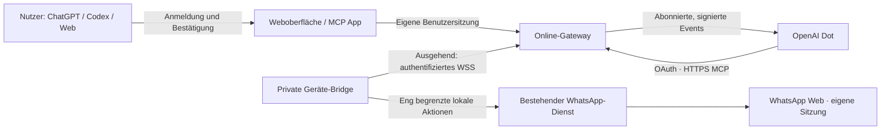

# WhatsApp Assistant online mit OpenAI Dots

Stand: 2. Oktober 2026. Architekturvorschlag und Umsetzungsplan; noch kein
öffentlich bereitgestellter Online-Dienst. Der private Handy-Dot-Status wurde
inzwischen durch den Nutzer mit einem Screenshot bestätigt.

Erster Umsetzungsstand: Ein separater rein lesender HTTP-MCP-Adapter mit
ausgehender Geräte-Bridge, Tokenprüfung und expliziten Chat-/Kontogrenzen ist
lokal implementiert. [Ausführbarer Pilot](../online/README.md) und
[Nachweise/offene Abnahme](ONLINE_PILOT_ACCEPTANCE.md). Das ersetzt noch nicht
den vollständigen Online-Login, die Bereitstellung oder den tatsächlichen Dots-Pilot.

Aktualisierung für den persönlichen Dot: Der offizielle **Secure MCP Tunnel**
ist jetzt der kürzere private Einstieg. Der neue eigene stdio-Server bietet
Status, ausgewählte Chats und Textlesen; nach ausdrücklicher Betreiberfreigabe
auch alle bestehenden Chats und bestätigten Textversand. Die fünf privaten
Werkzeuge ersetzen noch keinen unabhängigen menschlichen Bestätigungskanal:
Der Dot muss Empfänger und Volltext zeigen und eine neue Bestätigung abwarten.
Eine öffentliche Domain und ein eigener
OAuth-Anbieter sind für diesen privaten Tunnel nicht erforderlich. Für ein
öffentlich verteilbares Produkt bleibt die folgende Gateway-Architektur vorgesehen.
[Privaten Handy-Dot verbinden](PRIVATE_DOT_CONNECTION.md)

## Entscheidung

Für das später öffentlich nutzbare Produkt empfehle ich einen öffentlichen,
authentifizierten MCP-Dienst mit einer privaten Verbindung zum Gerät des Nutzers.
Die bestehende Oberfläche wird als MCP App und als angemeldete Weboberfläche
weiterverwendet. Dots nutzt denselben Dienst für gezielte Leseaufträge,
Zusammenfassungen, Antwortentwürfe und ausdrücklich eingerichtete Beobachtungen.

Die WhatsApp-Sitzung bleibt auf dem eigenen Gerät. Ein ständig eingeschalteter
Mac, beispielsweise ein eigener Mac mini, macht diese Verbindung dauerhaft
verfügbar. Ein Online-Gateway ersetzt diese Voraussetzung nicht. Das Produkt
zeigt deshalb getrennt den Status des Online-Dienstes und der WhatsApp-Verbindung.

Zuerst einen kleinen Dots-Pilot mit der lokalen Installation prüfen. Danach die
gemeinsam nutzbare Online-Version bauen. Eine vollständig betreiberseitig gehostete
persönliche WhatsApp-Sitzung ist ein gesondertes Produkt mit wesentlich größerem
Betriebs- und Sicherheitsaufwand.

## Was OpenAI aktuell dokumentiert

- Dots kann unterstützte Plugins und lokale Work-/Codex-Aufgaben verwenden.
  Zugriff auf den verbundenen persönlichen Rechner setzt voraus, dass er online
  und die ChatGPT-App geöffnet ist. Die konkrete Verfügbarkeit unseres lokalen
  Plugins und seiner Oberfläche muss im tatsächlichen Host geprüft werden.
  [Computer und Apps](https://learn.chatgpt.com/docs/dots/computers-and-apps)
- MCP Events ist ausdrücklich auch mit Dots vorgesehen. Dafür benötigt der
  Server MCP 2.0 mit Protokollversion `2026-07-28`, Ereignisabonnements und
  verifizierte, signierte HTTPS-Webhooks. OpenAI unterstützt dafür keine
  Polling- oder Streaming-Zustellung.
  [MCP Events](https://developers.openai.com/plugins/build/mcp-events)
- Öffentlich eingereichte Plugins benötigen einen stabilen HTTPS-MCP-Endpunkt
  mit Streamable HTTP. Ein temporärer Tunnel oder Loopback genügt nicht.
  [MCP-Server](https://developers.openai.com/plugins/build/mcp-server)
- Benutzerzugriff wird über OAuth mit PKCE und serverseitiger Tokenprüfung
  abgesichert. Einen etablierten Identitätsanbieter verwenden.
  [Authentifizierung](https://developers.openai.com/plugins/build/auth)
- WhatsApp als Werkzeug für Dots und WhatsApp als direkter Gesprächskanal zu
  Dots sind zwei verschiedene Funktionen. Die Kanaldokumentation beschreibt
  ChatGPT, Slack und Teams; Texting ist angekündigt. Sie belegt keinen frei
  nutzbaren WhatsApp-Kanal oder eine API zum Einspeisen unserer Nachrichten in
  die persönliche Dot-Unterhaltung.
  [Dots-Kanäle](https://learn.chatgpt.com/docs/dots/channels)
- Dots-Zugang ist Voraussetzung des Piloten. Der aktuelle Rollout nennt für
  Deutschland Business Premium beziehungsweise administrativ aktiviertes
  Enterprise; die genannten Pro-Pläne schließen den EWR gegenwärtig aus.
  [Verfügbarkeit](https://learn.chatgpt.com/docs/dots#access)

Diese Produktangaben sind dokumentiert, aber für unser Konto und Plugin noch
nicht praktisch abgenommen. Die folgenden Komponenten sind unser Entwurf.

## Drei mögliche Betriebsformen

| Weg | Nutzen | Voraussetzung | Empfehlung |
| --- | --- | --- | --- |
| Dots mit verbundenem eigenem Rechner | Schnellster Nachweis mit vorhandener Installation | Rechner online, ChatGPT-App offen, lokale Plugin-Unterstützung geprüft | Erster Pilot |
| Öffentliches MCP-Gateway mit privater Geräteverbindung | Von unterwegs nutzbar, mehrere Nutzer, gemeinsame Oberfläche, Events | Eigener laufender WhatsApp-Host und angemeldeter Online-Zugang | Erstes veröffentlichbares Produkt |
| WhatsApp-Verbindung vollständig beim Betreiber | Nutzung ohne eigenen laufenden Rechner | Isolierte Sitzungen, sichere Anmeldung, Betrieb und Wiederherstellung pro Nutzer | Separat untersuchen; nicht Grundlage der ersten Version |

Eine spätere Business-Ausgabe kann die offizielle WhatsApp Business Platform
verwenden. Meta beschreibt sie als API für Unternehmenskommunikation. Sie ist
deshalb eine eigene Integrationsstrecke; Zugriff auf dieselben persönlichen
Chats, Gruppen und Bestandsverläufe wird nicht vorausgesetzt und müsste separat
nachgewiesen werden.
[WhatsApp Business Platform](https://whatsappbusiness.com/products/business-platform/)

## Zielarchitektur der Online-Version

Die Verbindung zwischen Bridge und Gateway ist bidirektional, wird jedoch vom
Gerät ausgehend aufgebaut. Keine Routerfreigabe, kein öffentlich erreichbarer
Unix-Socket und kein Fernzugriff auf beliebige Shell- oder Browserbefehle.

### Online-Gateway

- Öffentlicher Streamable-HTTP-MCP-Endpunkt und separate angemeldete Weboberfläche.
  Eine gemeinsame Aktionsschicht verhindert unterschiedliche Sicherheitsregeln
  für Dots, MCP App und Browser.
- OAuth 2.1/PKCE für MCP; eigene abgesicherte Browsersitzung mit CSRF-Schutz.
  Nutzeridentität ausschließlich aus verifizierten Zugangsdaten ableiten.
- Lese-, Medien-, Beobachtungs- und Versandrechte getrennt vergeben. Chatfreigaben
  auch bei jedem Hintergrund-Leseauftrag serverseitig prüfen; Workspace und
  Nutzerkonto sind Teil der Identität, nicht nur eine E-Mail-Adresse.
- Jede Anfrage, Vorbereitung, Datei, Medienreferenz und Subscription an Nutzer,
  Gerät, WhatsApp-Konto und Sitzungsgeneration binden. Mandantenidentität darf
  niemals aus einem frei übergebenen Tool-Parameter stammen.
- Eng begrenzte Aktionen, Zeitlimits, Größenlimits und Limits pro Nutzer.
  Generische Socket-Weiterleitung, Dateipfade, URLs und JavaScript ausschließen.
- Kurzlebige Zugriffstoken, widerrufbare Gerätebindung, Rotation und überprüfbare
  Abmeldung. Getrennte Schlüssel für MCP-Zugang, Bridge und Ereigniszustellung.

### Private Geräte-Bridge

- Eigenes kleines Modul vor dem vorhandenen lokalen Dienst. Pairing mit einem
  einmaligen kurzlebigen Code; Bindung am angemeldeten Nutzer und am Gerät prüfen.
- Bestehende Validierung, Chatidentität, Kontoabgleich, Medienlimits und
  zweistufige Vorbereitung weiterverwenden. Die bisherige Prozessidentität für
  UI-Dateien ist keine Mehrnutzer-Isolation und wird nicht als solche übernommen.
- Ein Gerät ist pro WhatsApp-Konto aktiv. Bei Wechsel, Reconnect oder Neuverknüpfung
  wird die Sitzungsgeneration erneuert; alte Schreibfreigaben werden ungültig.
- Installation verbindet kein Konto und startet keine automatische Beobachtung.
  Einrichtung, dauerhaftes Starten und Chatfreigaben bleiben ausdrückliche Schritte.
- Bei Ausfall: Status sichtbar, Entwürfe erhalten, Lesen schlägt nachvollziehbar
  fehl. Keine Warteschlange, die später unbemerkt Nachrichten versendet.

### Daten und Medien

- Keine zentrale Spiegelung des gesamten Postfachs. Texte werden für autorisierte
  Leseaufträge übertragen; Medien nur auf ausdrücklichen Abruf oder Upload.
- Die Transportstrecken verwenden TLS. Das Gateway verarbeitet die angefragten
  Inhalte im Klartext; das ist keine durchgängige Ende-zu-Ende-Verschlüsselung
  zwischen WhatsApp und OpenAI. Betreiber und OpenAI sind je nach Aktion Empfänger
  dieser Daten. Diese Grenze muss vor Verbindung und Beobachtung erklärt werden.
- UI-Anzeige bleibt in privaten UI-Metadaten. Modell-Lesewerkzeuge geben nur den
  ausdrücklich angeforderten beziehungsweise für einen eingerichteten Auftrag
  freigegebenen Ausschnitt zurück. Keine automatische Übernahme aller Chats.
- Temporäre Medien mit kurzer TTL und Löschung nach Freigabe/Abbruch; keine
  öffentlichen Download-URLs. Downloads bleiben nutzergebunden, Dateien werden
  nicht als HTML ausgeführt. Browserentwürfe standardmäßig nur im Arbeitsspeicher.
- Dauerhaft speichern: Nutzer-/Gerätebindungen, Berechtigungen, Subscriptions,
  Widerrufe und minimale Versandstatusdaten. Keine Nachrichtenkörper in Logs,
  Fehlerberichten oder gewöhnlichen Betriebsmetriken.
- Das bisherige 30-Tage-Fenster und unvollständige Web-Historie bleiben sichtbar.
  Ein Online-Zugang verspricht keine vollständige Synchronisierung.

## Versand: vertrauenswürdige menschliche Freigabe

Online reicht es nicht, wenn das Modell eine `approval_id` aus der Vorbereitung
erhält und damit unmittelbar versenden kann. Der Server benötigt einen eigenen
Nachweis der menschlichen Bestätigung.

1. Dot oder Nutzer bereitet Empfänger, Text und gegebenenfalls Datei vor.
2. Die angemeldete Oberfläche zeigt vollständigen Text, eindeutigen Empfänger,
   eigenes sendendes Konto und Dateivorschau mit Name, Typ und Größe.
3. Erst die neue Betätigung von **Jetzt senden** erzeugt eine kurzlebige,
   signierte, einmalige Freigabe. Der Freigabe-Endpunkt wird nicht als
   Modellwerkzeug angeboten. Die Online-Freigabe verlangt eine Passkey-/WebAuthn-
   Verifikation mit Nutzerbestätigung. Deren einmalige Challenge wird serverseitig
   an den unveränderlichen Versandauftrag gebunden. Ein vom Agenten bedienbarer
   Browserknopf allein gilt nicht als menschlicher Freigabenachweis.
4. Die Bridge prüft Nutzer, Gerät, Sitzungsgeneration, Konto, Chatidentität und
   Hash des vollständigen Textes beziehungsweise der Datei. Danach verbraucht
   sie die Freigabe atomar vor dem eigentlichen Versand.
5. Doppelklicks liefern den vorhandenen Vorgangsstatus. Änderungen oder Ablauf
   erfordern eine neue Vorbereitung. Bei unklarer Zustellung bleibt der Zustand
   **Ergebnis unbekannt**; kein automatischer Wiederholungsversuch.

Die Bridge führt dafür ein dauerhaftes Vorgangsjournal:
`reserved → dispatching → sent / unknown`. Der Übergang zu `dispatching` wird
vor dem WhatsApp-Aufruf dauerhaft geschrieben. Ein Neustart nach diesem Übergang
ohne bestätigtes Ergebnis setzt den Vorgang auf `unknown`. Vorgangs-ID und Status
werden ohne Nachrichtentext aufbewahrt; Aufbewahrung und Löschung sind festzulegen.
Damit bleiben Doppelklick-, Timeout- und Wiederanlaufregeln auch nach einem
Prozessabsturz wirksam. Bei fehlender Bridge sofort `bridge_offline`; alte
Schreibanfragen werden bei Reconnect nicht wieder eingespielt.

Dot darf Status und Entwürfe bearbeiten, aber nicht selbst den menschlichen
Freigabenachweis erzeugen. Die vorhandene Automationsfunktion wird im ersten
Remote-Produkt nicht angeboten. Eine spätere Automationsfreigabe benötigt eine
eigene widerrufbare Regel mit Empfänger, Inhaltsspielraum und Versandgrenzen.

## Dots: erst gezielte Hilfe, dann abonnierte Ereignisse

Erste Funktionen:

- „Fasse diesen ausgewählten Chat seit gestern zusammen.“
- „Bereite auf diese drei Nachrichten eine Antwort vor.“
- „Beobachte den ausgewählten Projektchat bis Freitag und melde mir neue
  organisatorische Fragen in ChatGPT.“
- „Zeige mir für meine freigegebenen Chats, wo noch eine Antwort fehlt.“

Für Beobachtungen erhält der Nutzer eine verständliche Freigabe mit Chat,
Leseumfang, Zweck, Laufzeit und Benachrichtigungskanal. Installation allein
aktiviert nichts. Eine Beobachtungsseite zeigt aktive Aufträge und einen Stoppknopf.
Erinnerungen, Kalender-/Aufgabenübertragung und das Teilen privater Inhalte
benötigen jeweils die Berechtigung des betroffenen Dienstes.

Der öffentliche Server ergänzt `server/discover`, `events/list`,
`events/subscribe` und `events/unsubscribe` für das neue Events-Protokoll.
Der vorhandene Server bietet bisher maximal `2025-11-25`; ein HTTP-Wrapper
allein genügt nicht. Lokale Werkzeuge bleiben kompatibel, der Remote-Adapter
erhält eine separat geprüfte Protokollimplementierung.

Unser Ereignis `whatsapp.message.created` enthält standardmäßig nur eine opake
Chat-/Nachrichtenreferenz und den Zeitpunkt. Dot liest den freigegebenen Inhalt
gezielt nach. Der Bridge-Adapter erzeugt Ereignisse für neue Nachrichten,
unabhängig davon, ob eine Oberfläche geöffnet ist. Historisch nachgeladene
Nachrichten und eigene Sendungen werden nicht als neue eingehende Ereignisse
behandelt. Nach Ausfällen werden Lücken und verspätete Ereignisse kenntlich gemacht.

Subscriptions und Ereignis-IDs bleiben über Neustarts erhalten. Pro Nutzer gelten
Filter, Widerruf, Laufzeit und Lastlimits. Wiederholte Ereigniszustellung ist
deduplizierbar und darf keinen wiederholten WhatsApp-Versand auslösen. Nachrichtentext
bleibt untrusted data, auch wenn er Anweisungen an einen Agenten enthält.

Callback-Ziele werden als öffentliche HTTPS-Adressen geprüft, einschließlich
DNS-Auflösung bei jeder Verbindung; keine privaten Ziele oder Weiterleitungen.
Signatur, Verifikation und Wiederholungen implementieren wir nach der
[OpenAI-Ereignisspezifikation](https://developers.openai.com/plugins/build/mcp-events).
Ein erfolgreicher Webhook ist erst Transportannahme; Abnahme verlangt das
tatsächliche Ergebnis in der Dot-Unterhaltung.

## Umsetzung mit Abnahmekriterien

Die Zeitangaben sind grobe Entwicklungsaufwände für konzentrierte Arbeit,
keine Zusagen. Externe Freischaltung und Reviewzeiten kommen hinzu.

| Etappe | Ergebnis | Abnahme | Aufwand |
| --- | --- | --- | --- |
| 1. Dots-Pilot | Zugriff über verbundenen Rechner; ausgewählter Chat, Zusammenfassung, Entwurf | Tatsächlicher Dot-Aufruf, korrektes Konto, keine fremden Chats oder Sends; Leerlauf, Offlinezustand und Wiederanlauf; Host-/UI-Unterstützung dokumentiert | 2–5 Arbeitstage bei vorhandenem Zugang |
| 2. Online-Grundlage | OAuth, Geräte-Pairing, ausgehende Bridge, HTTPS MCP, Status und gezieltes Lesen | Zwei synthetische Nutzer strikt getrennt; Offline, Tokenwiderruf, Reconnect, Kontoänderung und Größenlimits geprüft | 2–3 Wochen |
| 3. Oberfläche und bestätigter Versand | Gemeinsame MCP App/Weboberfläche, Medien, menschliche Freigabe und Vorgangsstatus | Geänderter Text/Empfänger/Anhang, Doppelklick, Ablauf, Agentenzugriff auf Freigabe, Verbindungsabbruch und Crash in jedem Versandzustand; echter Versand nur gesondert genehmigt | 1–2 Wochen |
| 4. Dots Events | Chatfreigaben, Ereignisse und widerrufbare Beobachtungsaufträge | Neue passende Nachricht löst richtigen Dot-Auftrag aus; fremder Chat, historische Nachricht, Duplikat, abgelaufener Auftrag und Prompt-Injection tun es nicht | 1–2 Wochen |
| 5. Öffentliche Beta | Betrieb, Monitoring, Installation, Support, Datenschutz, Reviewer-Paket | Frischer Nutzer verbindet eigenes Gerät; vollständiger Ablauf im unterstützten Host; fünf positive/drei negative Reviewfälle und aktuelle Aufnahme | 1–2 Wochen plus externes Review |

Für eine belastbare erste öffentliche Version plane ich damit ungefähr **5–9
Wochen Entwicklung nach dem Pilot**, abhängig von der wiederverwendbaren
Host-Unterstützung und dem Versandfreigabekanal. Die obere Summe ist neun Wochen;
für Protokoll- oder Authentifizierungsprobleme ist zusätzlicher Puffer einzuplanen.

### Geplante Codeaufteilung

- Bestehende `runtime/service.mjs`-Prüfungen und Medienmodule weiterverwenden.
- Neu: `bridge/` für Pairing, ausgehenden Kanal, eng begrenzte Befehle,
  Sitzungswechsel und dauerhafte Versand-Deduplizierung.
- Neu: `gateway/` für OAuth-Prüfung, Mandantenrouting, HTTP MCP,
  Benutzerfreigaben, Status und Ereignisabonnements.
- `web/` erhält einen Remote-Transport und Kontoeinrichtung; die vorhandenen
  lokalen Transporte bleiben getrennt nutzbar.
- Eigene Remote-Manifeste und Prüfsätze; keine öffentlichen Zugangsdaten oder
  Dummy-Endpunkte in der lokalen 0.3.0-Konfiguration.
- Tests mit synthetischen Konten und Nachrichten; nach bestandenen Backendtests
  Browser-, MCP-Host- und tatsächliche Dots-Abnahme.

### Betrieb für den ersten Pilot

Ein kleines Container-Setup in einer EU-Region mit HTTPS-Reverse-Proxy,
Gateway, etabliertem Identitätsanbieter und PostgreSQL genügt als Ausgangspunkt.
Der Gateway-Prozess muss dauerhafte WebSocket-Verbindungen unterstützen;
kurzlebige Request-Funktionen sind dafür keine geeignete erste Wahl.
Keine gesonderte Modell-API im Gateway: Dot übernimmt Zusammenfassung und Entwürfe.

Vor Skalierung messen wir aktive Bridges, Speicherverbrauch, gleichzeitige
Medienübertragungen und Eventlast. Hinzu kommen Updates, Backups der minimalen
Steuerdaten, Wiederherstellung, Schlüsselrotation, Löschablauf und Support.
Für einen vollständig gehosteten WhatsApp-Browser würden diese Kosten pro
Sitzung erheblich anders aussehen; deshalb keine pauschale Kostenprognose.

## Konkrete offene Entscheidungen und Grenzen

1. Dots im Konto/Workspace verfügbar und benötigte lokale sowie native
   UI-Funktionen praktisch unterstützt? Der Pilot beantwortet das zuerst.
2. Herausgeber, Domain, Hostingkonto, Supportkontakt und Auth-Anbieter festlegen.
   Vor Veröffentlichung tatsächliche Datenwege, Aufbewahrung und Betreiberrollen
   in den Datenschutzunterlagen abbilden.
3. Ein verifizierbarer menschlicher Freigabekanal ist Voraussetzung für Remote-
   Versand. Fehlt er im Host, bleibt Versand bis zur separaten Nutzerbestätigung
   gesperrt; Modellbestätigung zählt nicht als Nutzerbestätigung.
4. Die bestehende WhatsApp-Web-Integration ist keine offizielle Meta-Business-
   API. Kompatibilität, zulässiger Betrieb und Supportfähigkeit müssen vor der
   öffentlichen Beta konkret bewertet werden; eine OpenAI-Aufnahme ist keine
   Meta-Freigabe. Keine pauschale Zusage „für jedes Konto“.
5. Direkte Unterhaltung mit der eigenen Dot-Instanz über WhatsApp bleibt ein
   separater Prüfpunkt für eine dokumentierte OpenAI-Kanalintegration. Ein eigener
   API-Chatbot wäre ein anderes System mit eigener Identität und eigenem Kontext.

Die nächste sinnvolle Arbeit ist der begrenzte Dots-Pilot und anschließend eine
rein lesende Online-Grundlage. Das ermöglicht frühe Nutzungsnachweise, bevor
Fernversand und öffentliche Veröffentlichung freigeschaltet werden.
